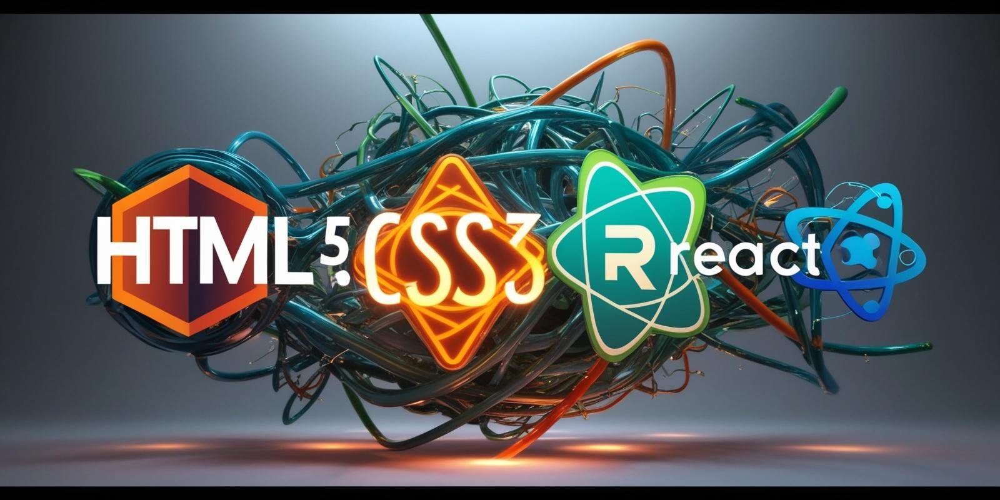

# Hello World!, I'm Ravan 👋🏼:

## 🚀 About Me

I’m a passionate front-end developer who loves turning ideas into interactive, responsive web experiences.  
Currently exploring modern frameworks, refining my JavaScript skills, and diving deep into design systems. Always eager to learn, collaborate, and build something amazing!  
🛜 Currently working on Real Project  👨🏼‍🎓 👨🏼‍💻 working as a web developer since 2022

## 🌟 Skills & Expertise

- **Modern HTML/CSS** (Flexbox, Grid, responsive design)
- **Preprocessors:** Sass, SCSS, Less
- **JavaScript:** ES6+, DOM APIs, Fetch/Axios
- **Frameworks & Libraries:** React, Tailwind CSS, Bootstrap, Ant Design
- **Build Tools:** npm scripts, Vite, Webpack basics
- **Version Control:** Git & GitHub
- **Soft Skills:** Problem-solving 🧩, collaborative teamwork 🤝, logical thinking 🧠

# 💻 Tech Stack:

                

<picture>
  <source media="(prefers-color-scheme: dark)" srcset="https://raw.githubusercontent.com/tobiasmeyhoefer/tobiasmeyhoefer/output/github-snake-dark.svg" />
  <source media="(prefers-color-scheme: light)" srcset="https://raw.githubusercontent.com/tobiasmeyhoefer/tobiasmeyhoefer/output/github-snake.svg" />
  
</picture>
